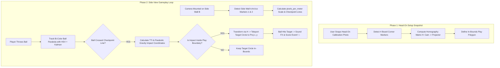

# "Miss The Target Challenge" - Master Architecture & Design Document

> An interactive physical Augmented Reality (AR) game where players throw a ball at a wall aiming to **MISS** a projected target circle. An AI computer vision system tracks the ball mid-flight, predicts the exact wall impact point, and teleports the target circle right in front of the ball so the player hits it and loses! 🎯💥

---

## Executive Summary & System Overview

This document combines our **two breakthrough computer vision and physical setup concepts** into a unified, high-precision interactive game engine:

1. **2-Phase Camera Setup**: Uses a 1-snap head-on setup for whiteboard calibration, followed by a **Side-Mounted Gameplay Camera** for tracking full parabolic ball flights without player occlusion.
2. **Perpendicular Side-Wall Timing Gate (2 ArUco Markers)**: Mounted on the side wall, facing flat to the side gameplay camera to provide exact scale, speed measurement, and 200–400 ms projector lead-time.
3. **Target Whiteboard Homography & Boundary Lock (4 Corner ArUco Markers)**: Solves projector zoom/keystone calibration and enforces strict in-bounds / out-of-bounds play area protection.

---

## Physical Setup & Dual-Camera Workflow

### 1. Calibration Phase (Head-On Snapshot)
* User holds phone/camera facing **Head-On** at the Target Whiteboard for 1 setup snapshot.
* Detects 4 Whiteboard Corner ArUco Markers ($C_0, C_1, C_2, C_3$) to calculate the 3x3 Projector Homography Matrix $H$ and define the in-bounds play polygon.

### 2. Gameplay Phase (Side-Mounted Camera)
* The camera is mounted on **Opposite Side Wall B**, facing sideways across the room toward **Side Wall A**.
* **Why Side View for Gameplay?**:
  1. Leaves the middle floor completely open for kids to stand and throw without blocking the camera!
  2. Captures the ball's **entire parabolic flight path** in clear side-profile from release to wall impact.
  3. Sees Side Wall A ArUco Markers 1 & 2 **flat and un-distorted** for high-precision checkpoint timing!

---

## Physical Layout Diagram

```
                                  [ TARGET WHITEBOARD / WALL PLANE ]
                     ArUco Corner 0 (Top-Left)               ArUco Corner 1 (Top-Right)
                      +-------------------------------------------------------+
                      |                                                       |
                      |                  PROJECTOR CANVAS                     |
                      |                 (Target Circle Display)               |
                      |                                                       |
                      +-------------------------------------------------------+
                     ArUco Corner 3 (Bottom-Left)           ArUco Corner 2 (Bottom-Right)
                     ^ 
                     | (Corner Intersection)
  [ SIDE WALL A ]    | <- ArUco Marker 2 (Wall Corner Line)
                     |
                     |
                     |
                     | <- ArUco Marker 1 (Midway Checkpoint ~1.5m in front of wall)
                     |
                     +-------------------------------------------------------+
                     
                     
                     [ OPEN PLAY ZONE FOR KIDS TO THROW BALL ]
                     
                     
                     +-------------------------------------------------------+
  [ OPPOSITE         |
    SIDE WALL B ]    | 🎥 GAMEPLAY CAMERA (Mounted on Opposite Wall, Facing Sideways)
                     |    - Captures Parabolic Flight Arc from player's hand to wall
                     |    - Clear, flat view of Side Wall A ArUco Markers 1 & 2
                     +-------------------------------------------------------+
```

---

## System Component Breakdown

### 1. Perpendicular Side-Wall Timing Gate (2 ArUco Markers)
* **Marker 1 (Midway Checkpoint)**: Mounted on Side Wall A $\sim 1.5\text{ meters}$ in front of the target wall. Defines the 2D vertical line $X_{\text{checkpoint}}$.
* **Marker 2 (Wall Corner Line)**: Mounted on Side Wall A right at the corner intersection next to **ArUco Corner 3 (Bottom-Left)** of the whiteboard. Defines the 2D vertical line $X_{\text{wall}}$.
* **Side-View Tracking Logic**:
  1. **Scale Calculation**: Distance between Marker 1 and Marker 2 in side-camera pixels gives exact $\text{pixels\_per\_meter}$ physical scale factor.
  2. **Checkpoint Event**: As soon as the ball center $X$ crosses $X_{\text{checkpoint}}$, the AI locks onto the velocity vector $(v_x, v_y)$.
  3. **Time-to-Impact ($TTI$)**:
     $$t_{\text{impact}} = \frac{\text{Distance}(\text{Marker 1 to Marker 2 in meters})}{\text{Velocity } v_x}$$
  4. **Parabolic Impact Prediction**:
     $$x_{\text{impact}} = X_{\text{wall}}$$
     $$y_{\text{impact}} = Y_{\text{checkpoint}} + v_y \cdot t_{\text{impact}} + \frac{1}{2} g \cdot (t_{\text{impact}})^2$$
  5. **Lead Time**: Gives the projector $\sim 200\text{--}400\text{ ms}$ of advance notice to shift the target circle into place before impact!

---

### 2. Whiteboard Calibration & Boundary Lock (4 Corner ArUco Markers)
* **Markers 0, 1, 2, 3**: Placed at the 4 corners of the target whiteboard/wall.
* **Head-On 1-Snap Auto-Calibration**:
  1. Camera snaps 1 setup picture showing the 4 corner ArUco codes on the wall.
  2. OpenCV detects corner camera points $C_0, C_1, C_2, C_3$ and maps them to projector display points $P_0, P_1, P_2, P_3$.
  3. Runs `H, _ = cv2.findHomography(camera_corners, projector_corners)`.
  4. Matrix $H$ automatically solves **projector zoom, magnification, keystone tilt, and offset** in $< 1\text{ ms}$.
* **In-Bounds / Out-of-Bounds Protection**:
  * Defines a strict 4-point convex polygon boundary.
  * If a wild throw is calculated to land outside the 4-corner polygon, the target circle remains safely inside the play boundary (**Out-of-Bounds Safety**).

---

### 3. Ball Identification & Tracking (Bi-Color / High-Contrast)
* **Ball Design**: Uses a **Bi-Color Ball** (e.g. Pink + Cyan or Orange + Green) or high-contrast color pattern.
* **Detector**: Looks for touching color pairs within 15 pixels, making it **100% immune to background noise** (such as green plants or cream walls).
* **State Estimator**: 2D Kalman Filter tracking position $(x, y)$ and velocity $(v_x, v_y)$ with smooth trajectory history tail.

---

## Complete Software & Calibration Workflow



---

## Summary of Saved Files & Artifacts

- 📄 [`game_design_and_architecture.md`](file:///c:/Development/labs/greenball/game_design_and_architecture.md): This master architecture document.
- ⚙️ [`config.py`](file:///c:/Development/labs/greenball/config.py): Project configuration parameters.
- 🔍 [`hsv_detector.py`](file:///c:/Development/labs/greenball/hsv_detector.py): Color & shape blob detector.
- 📈 [`kalman_tracker.py`](file:///c:/Development/labs/greenball/kalman_tracker.py): 2D Kalman Filter state estimator.
- 📐 [`trajectory_predictor.py`](file:///c:/Development/labs/greenball/trajectory_predictor.py): Ray-segment wall impact calculator.
- 🎬 [`track_video.py`](file:///c:/Development/labs/greenball/track_video.py): Video file batch processor and visualizer.
